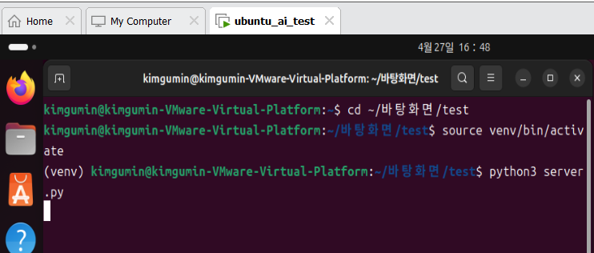
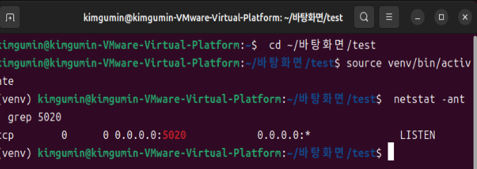
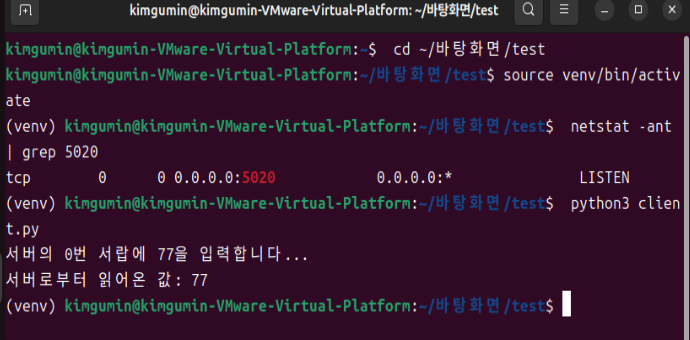
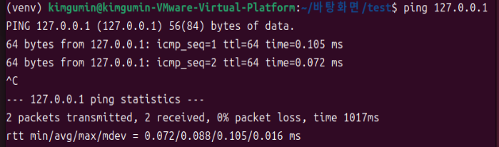
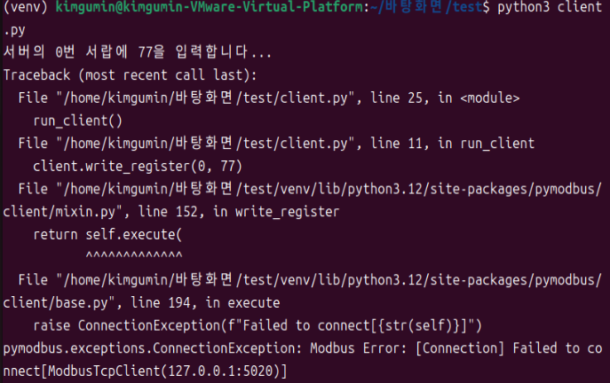
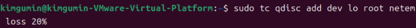
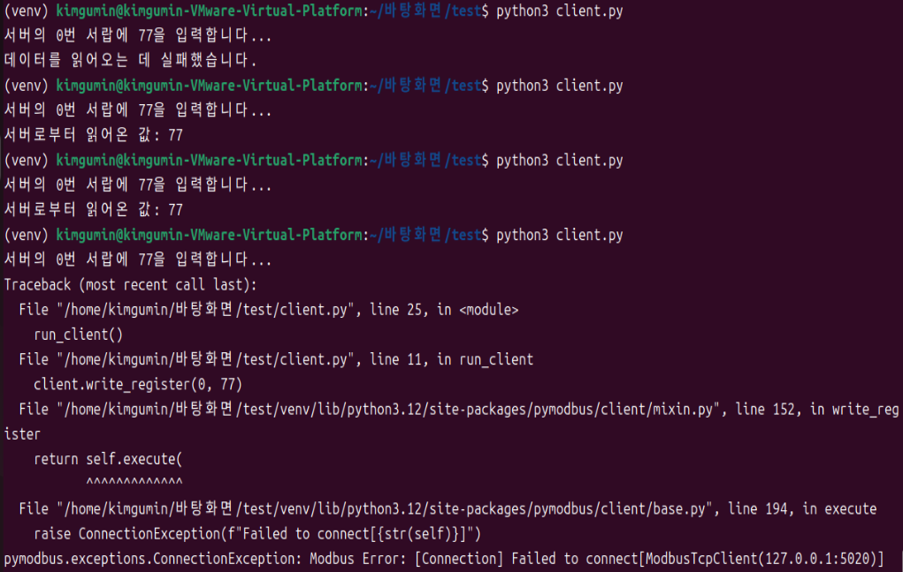

##  Modbus TCP 산업 네트워크 장애 대응 시스템 구축 가이드

### 1. 환경 구축     

##### 준비물
- OS: VMware Workstation - Ubuntu Linux
- 통신 프로토콜: Modbus TCP
- 필수 도구: Python 3, pymodbus (3.1.0 버전), net-tools

##### 설치 명령어
- 작업 디렉토리 이동 및 가상환경 입장  
```
cd ~/바탕화면/test   
python3 -m venv venv   
source venv/bin/activate    # (venv) 표시가 있어야 함.
```
##### 필수 라이브러리 설치
```
pip install pymodbus==3.1.0
sudo apt install net-tools
```


### 2. Modbus 통신 시뮬레이션

##### 목표
>- 서버 가동 및 포트 개방: 리눅스 환경에서 가상 Modbus TCP 서버를 구동하여 5020번 테스트 포트를 활성화하고, 외부 접속을 수용할 수 있는 대기(LISTEN) 상태를 구축
>- 데이터 쓰기 및 읽기(Read/Write) 검증: 클라이언트가 서버의 특정 레지스터 주소에 데이터 "77"을 기록(Write)하고, 이를 다시 조회(Read)하여 성공적으로 반환받음으로써 송수신 과정의 데이터 정합성과 통신 안정성을 확인

##### 1) 서버 실행 (데이터 서랍 준비)
- 가상 서버 활성화
```
cd ~/바탕화면/test     
source venv/bin/activate    # (venv) 표시가 있어야 함.
```

- 5020번 포트가 열리고 100개의 빈 서랍이 생성
```
python3 server.py
```


##### server.py
``` python
# 1. 필요한 모듈 불러오기 (도구 상자 꺼내기)
from pymodbus.server import StartTcpServer       # TCP 방식의 서버를 시작하는 함수
from pymodbus.device import ModbusDeviceIdentification # 장비의 이름, 제조사 등 정보를 정의하는 클래스
from pymodbus.datastore import ModbusSequentialDataBlock # 데이터가 들어갈 '연속된 서랍장'을 만드는 도구
from pymodbus.datastore import ModbusSlaveContext, ModbusServerContext # 개별 장비(Slave)와 전체 서버 관리용 틀

def run_server():
    # 2. 데이터 저장소(Data Store) 구축
    # Modbus 프로토콜의 4가지 서랍장을 만듭니다.
    # SequentialDataBlock(시작주소, 초기값리스트) -> [0]*100은 0이 담긴 서랍 100개를 의미
    store = ModbusSlaveContext(
        di=ModbusSequentialDataBlock(0, [0]*100), # Digital Inputs (읽기 전용 비트 - 온/오프)
        co=ModbusSequentialDataBlock(0, [0]*100), # Coils (읽고 쓰기 가능 비트 - 스위치)
        hr=ModbusSequentialDataBlock(0, [0]*100), # Holding Registers (읽고 쓰기 가능 숫자 - 77이 저장되는 곳)
        ir=ModbusSequentialDataBlock(0, [0]*100)  # Input Registers (읽기 전용 숫자)
    )
    
    # 여러 대의 Slave 장비가 있을 수 있지만, 여기서는 1대만(single=True) 운영하도록 설정
    context = ModbusServerContext(slaves=store, single=True)

    # 3. 장비 신원 정보 설정 (장비 명찰 달기)
    # 실제 산업 장비에서 "나는 어디 제조사의 어떤 모델이다"라고 알려주는 정보입니다.
    identity = ModbusDeviceIdentification()
    identity.VendorName = 'Pymodbus'           # 제조사 이름
    identity.ProductCode = 'PM'                # 제품 코드
    identity.ProductName = 'Pymodbus Server'   # 제품명
    identity.ModelName = 'Pymodbus Server'     # 모델명
    identity.MajorMinorRevision = '3.1.0'      # 소프트웨어 버전

    # 4. 서버 실제 가동 (문 열고 손님 받기)
    # address=("0.0.0.0", 5020)
    # - 0.0.0.0 : 외부든 내부든 어떤 IP 주소로 들어와도 접속을 허용하겠다는 뜻
    # - 5020 : 손님이 들어올 전용 대문(포트 번호)
    print("모드버스 TCP 서버 가동 중... (포트: 5020)")
    StartTcpServer(
        context=context,   # 위에서 만든 서랍장 세트 전달
        identity=identity, # 장비 명찰 정보 전달
        address=("0.0.0.0", 5020) # 접속 주소 및 포트 설정
    )

# 5. 이 파일이 직접 실행될 때만 run_server 함수를 실행
if __name__ == "__main__":
    run_server()
```
##### 2) 서버 상태 확인(잘 전달되었는지) (새 터미널에서)

- LISTEN일시 서버가 접속을 기다리는 정상 상태
```
netstat -ant | grep 5020
```

##### 3) 클라이언트 실행
```
python3 client.py
```



##### client.py
```python
# 1. 모드버스 클라이언트 도구 가져오기
from pymodbus.client import ModbusTcpClient # TCP 방식으로 서버에 접속하는 클라이언트 클래스

def run_client():
    # 2. 서버 접속 설정
    # '127.0.0.1' (localhost): 내 컴퓨터 자신을 의미하는 IP 주소
    # port=5020: server.py에서 열어둔 대문 번호와 똑같이 맞춰야 합니다.
    client = ModbusTcpClient('127.0.0.1', port=5020)
    client.connect() # 설정한 주소로 실제 연결 시도

    # 3. 데이터 쓰기 (Write)
    # 서버의 Holding Register 영역 중 0번 주소(첫 번째 서랍)에 숫자 77을 저장합니다.
    print("서버의 0번 서랍에 77을 입력합니다...")
    client.write_register(0, 77)

    # 4. 데이터 읽기 (Read)
    # read_holding_registers(시작주소, 읽을개수)
    # 0번 서랍부터 시작해서 1개만 읽어오라는 요청입니다.
    result = client.read_holding_registers(0, 1)
    
    # 5. 결과 확인 및 예외 처리
    # 네트워크 지연이나 손실이 발생하면 result.isError()가 True가 됩니다.
    if not result.isError():
        # 정상적으로 읽어왔다면 .registers[0] 리스트의 첫 번째 값을 출력
        print(f"서버로부터 읽어온 값: {result.registers[0]}")
    else:
        # 패킷 손실 100%나 서버 다운 시 실행되는 구간
        print("데이터를 읽어오는 데 실패했습니다.")

    # 6. 접속 종료 (안전하게 대문 닫기)
    client.close()

if __name__ == "__main__":
    run_client()
```

##### 통신 프로세스
|단계|액션|명령어/코드(client.py)|설명
| :---: | :---:| :---: | :---: |
|1|데이터 쓰기|client.write_register(0, 77)|클라이언트가 0번 서랍에 '77'을 저장|
|2|데이터 읽기|"client.read_holding_registers(0, 1)|0번 서랍에서 데이터를 1개 읽어옴|
|3|결과 확인|화면 출력|터미널에 숫자 77이 찍히면 통신 성공|


### 3. 통신 지연 시뮬레이션
##### 목표
>인위적인 응답 지연을 통해 단순 네트워크 부하와 서버 과부하(DDoS 공격 등)를 데이터로 구분하고 시스템의 내구성을 검증

#### 1) 인위적인 지연 시간 추가 (새 터미널에서)
- 500ms(0.5초)의 인위적인 지연을 추가
```
sudo tc qdisc add dev lo root netem delay 500ms
```
.png)
| |lo(loopback)|ens33(Ethernet)|
| :---: | :---: | :---: |
|의미|내 컴퓨터 자신을 가리키는 가상 통로 |외부 네트워크와 연결되는 진짜 랜카드
|IP 주소|항상 127.0.0.1 (localhost)|192.168.x.x 등 공유기가 준 실제 IP
|비유|집 안에서 거실-안방 사이에 말을 거는 것|집 대문을 열고 옆집 사람과 대화
|언제 쓰는가?|한 컴퓨터 안에서 서버, 클라이언트를 다 띄울 때|서버와 클라이언트가 서로 다른 컴퓨터일 때

#### 2) 지연 효과 확인 (클라이언트 실행)
```
python3 client.py
```

#### 3) 핑 시간 확인
- 500ms일시 오고 가는데 2번 지나가므로 time=1000ms 출력
```
ping 127.0.0.1

```

#### 4) 설정 초기화
- 모든 네트워크의 제한 해제
```
sudo tc qdisc del dev lo root
```

#### 핑 시간을 2000ms로 설정하고 실행 결과: 오류 발생   
> 모드버스 클라이언트 라이브러리는 기본적으로 타임아웃(기다려주는 시간)이 설정되어 있음 (보통 기본값은 3초 내외)
클라이언트는 3초만 기다리고 문을 닫으려는데, 데이터는 4초 뒤에 오니까 통신 실패(오류)를 뱉어버림
.png)


### 4. 패킷 손실 시뮬레이션
##### 목표
> 데이터 유실 상황을 재현하여 전송 신뢰도를 측정하고, 데이터 누락 시에도 AI 판단의 연속성을 유지하는 보간 로직을 검증

#### 1) 손실률 설정 
```
sudo tc qdisc add dev lo root netem loss 20%
```


#### 2) 테스트 결과(장애 판단 결과)
|결과 데이터|분류|의미|진단
| :---: | :---: |:---: | :---: |
|Traceback (most recent call last_:~~~~|네트워크 치명적 오류|서버에 접속을 시도하는 패킷 자체가 유실되어 통로 자체가 연결되지 않음|Packet Loss 100%에 가까운 상태로 판단하며, 물리적인 케이블 단절이나 서버 다운과 동일한 상태로 취급합니다. 코드 실행 자체가 중단된 상황
|서버로부터 읽어온 값: 77|정상 패킷 수신|손실률을 뚫고 운 좋게 패킷이 왕복에 성공한 경우|RTT 및 Jitter 측정 가능. AI에게는 이 데이터가 "현재 통신이 완전히 죽은 건 아니지만, 매우 불안정하다"는 것을 알려주는 핵심 지표가 됨.
|데이터를 읽어오는데 실패했습니다|모드버스 타임아웃|서버와 연결은 되었으나, 데이터를 달라는 요청이나 응답 패킷 중 하나가 사라져서 클라이언트가 기다리다 지쳐 포기한 경우|데이터는 오지 않았지만 프로그램은 살아있으므로 '로그 수집'이 가능한 장애 상태




